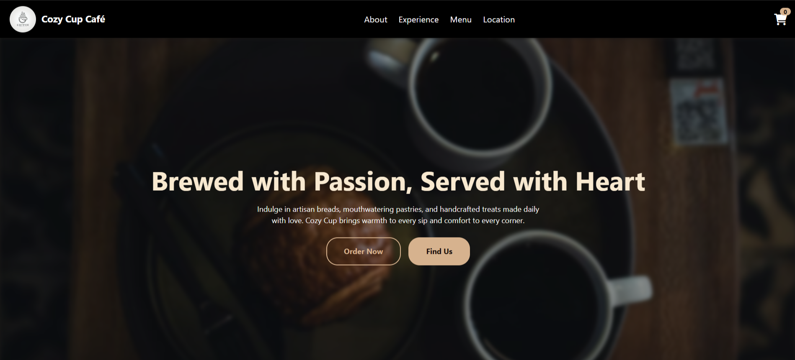
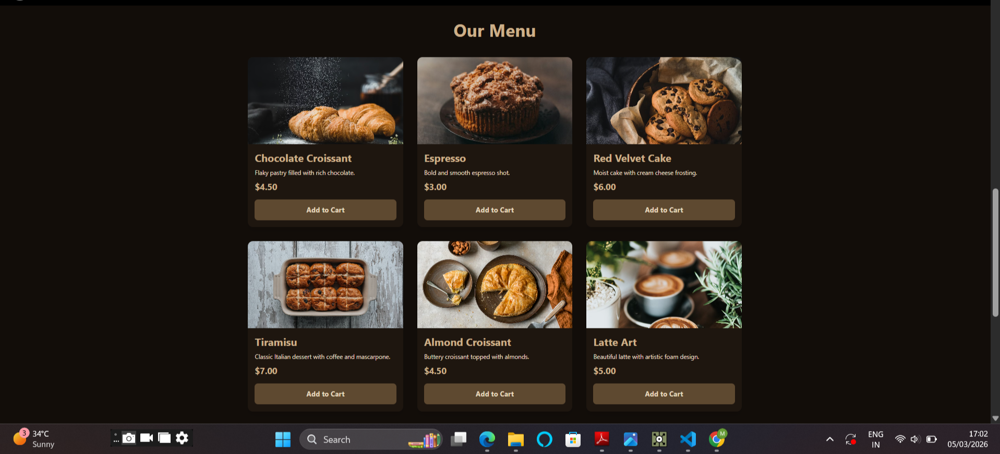

# ☕ Cozy Cup Café


A website for a café to solve the problem that many don't have an online presence.
This website serves as an online presence for Cozy Cup Café.
Customers can view the menu, add items to the cart, and view the location.
This website meets the requirements for a small café's online presence.

🔗 **Live Demo:** [cafe-shop-k5o6.vercel.app](https://cafe-shop-k5o6.vercel.app)

---

## Preview




---

## Features
- Browse menu by category
- Add to cart
- View location

---

## Tech Stack


---

## Getting Started
```bash
npm install
npm run dev
```

---

## Author
**Mubashira Suroor** — [GitHub](https://github.com/mbsira) · [Behance](https://www.behance.net/mubashiraansari1)
