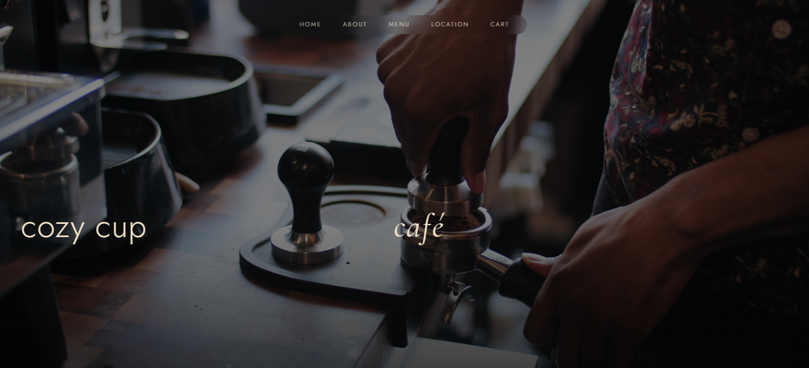
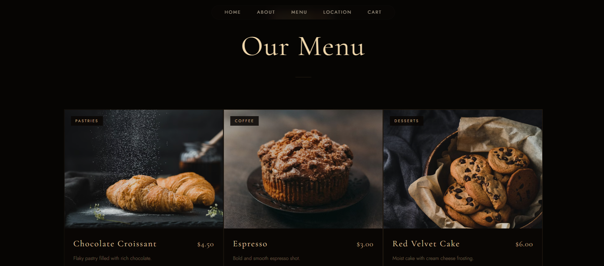

# Cozy Cup Café — Website Redesign
This is a portfolio project — not a real brand or business.
 
A brand website for Cozy Cup Café built using **React**, **Vite**, and **Tailwind CSS**. The design is inspired by high-end restaurants like **Momofuku**.
---
## Preview
### Home

### Menu

---
## Design Philosophy
The old website was functional but looked generic. The new design focuses on:
- Mixing serif (`Cormorant Garamond`) and clean sans (`Jost`) fonts
- Sharp corners for a precise, editorial feel
- Generous space between elements
- A subtle gold accent color (`#d6b28e`) on a deep dark background
---
## Sections
### 1. Hero
Full-screen video background with staggered load animations. `cozy cup` sits bottom-left in thin sans, `café` bottom-right in italic serif.
### 2. Navbar
Floating pill navbar with frosted glass blur. No logo — text only, uppercase spaced letters. Cart badge updates live.
### 3. About
Editorial heading mixing italic + caps. Chef image in the center — hovering slides info text out left and right simultaneously.
### 4. Video Section
Three full-height video panels. Hovering expands the active panel and fades in delivery information.
### 5. Menu
Sharp-cornered cards in a thin gold-gap grid. Hover lifts the card, zooms the image, and reveals the add to cart action.
### 6. Categories
Minimal pill tab switcher. Active tab fills gold, others stay transparent.
### 7. Cart Modal
Drawer that slides in from the right. Blurred overlay behind. Clean item list with faint remove text that brightens on hover.
### 8. Location & Contact
Greyscale inverted map to match the dark theme. Borderless inputs with a bottom line that brightens on focus.
### 9. Footer
Three-column grid — brand tagline, quick links, and contact details.
---
## Hover Effects
| Component | What happens |
|-----------|-------------|
| Navbar links | Brighten to white |
| Hero buttons | Lift with gold glow |
| Chef image | Text slides out left and right |
| Video panels | Panel expands, delivery info fades in |
| Menu cards | Card lifts, image zooms, border brightens |
| Cart remove | Text brightens to gold |
| Checkout button | Fills with gold background |
| Contact send | Line and text brighten to gold |
---
## Tech Stack
- **React** + **Vite**
- **Tailwind CSS**
- **Lenis** — smooth scrolling
- **Framer Motion** — entrance animations
- **Google Fonts** — Cormorant Garamond + Jost
- **Pexels** — royalty free video backgrounds
---
## Getting Started
```bash
# Install dependencies
npm install
# Run dev server
npm run dev
# Build for production
npm run build
```
---
## Project Structure
```
src/
├── components/
│   ├── Navbar.jsx
│   ├── Hero.jsx
│   ├── Exterior.jsx
│   ├── VideoSection.jsx
│   ├── Categories.jsx
│   ├── Products.jsx
│   ├── CartModal.jsx
│   ├── Location.jsx
│   └── Footer.jsx
├── data/
│   └── products.js
└── App.jsx
```
---
## Known Issues
- Videos may not autoplay on mobile due to browser restrictions
- Pixabay video URLs are blocked for external use — use Pexels or self-host
- Fonts may flash briefly on first load
- Cart resets on page refresh — no persistent storage yet
---
## Credits
- Design inspiration: [Dribbble — Restaurants Chain Website by Mirhayot](https://dribbble.com/shots/26283853-Restaurants-Chain-Website)
- Videos: [Pexels](https://pexels.com)
- Fonts: [Google Fonts](https://fonts.google.com)
---
*Built by mbsira*
